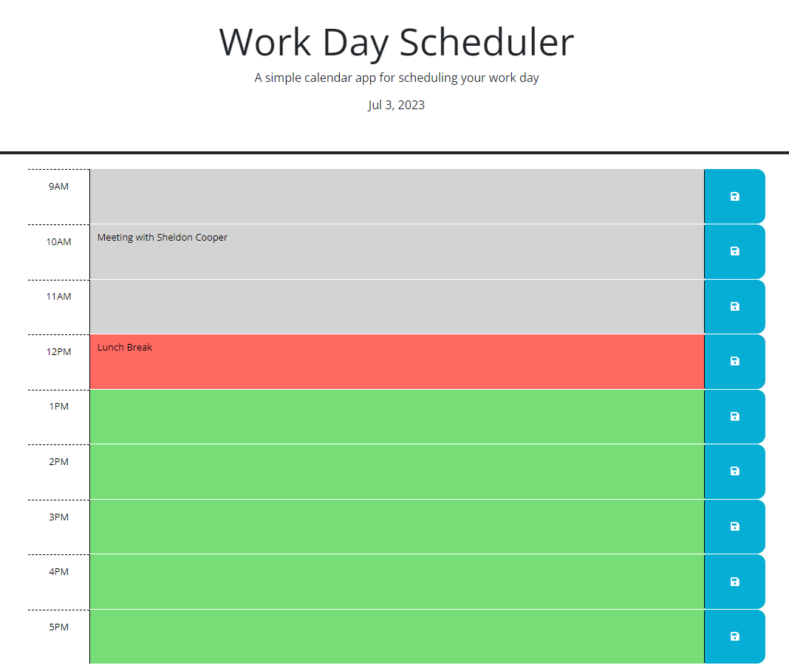

# Work Day Scheduler 

## Description

This website is a simple calendar application that saves events occurring throughout the workday from the hours of 9-5pm. The application is created with HTML, CSS, powered by jQuery and Day.js.

The scheduler was developed with following criteria:

- The current day is displayed at the top of the page
- There are time blocks for each hour of the day from 9am-5pm
- Each time block is color coded to indicate  whether the event is in the past, present, or future
- When the save button is clicked for specific time block the text entered is stored in local storage
- When the page is refreshed the saved events persist 

## Installation

N/A

## Usage

Enter your events into the corresponding hour to create an overview of your day. When you enter an enter for an hour click on the save button to store the event in local storage. Local storage can be accessed using the dev tools and navigating to application in the navigation bar. In storage click on local storage to view saved events. If you refresh the page all of the events you have saved will still be present on the page.

 

## Credits

N/A

## [Scheduler Website Link](https://l-lavelle.github.io/Work-Day-Scheduler/)